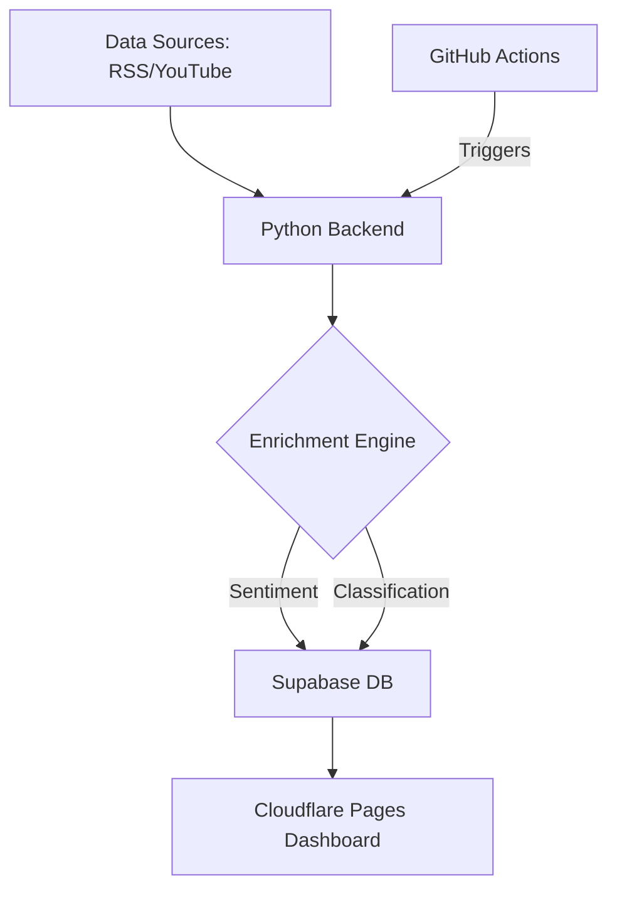

# 📡 WBAE2026 · Phase 1 Digital Monitoring System

> **Real-time Political Intelligence & Sentiment Analysis for the 2026 West Bengal Assembly Elections.**


---

## 🏛 Project Overview

WBAE2026 is a specialized intelligence dashboard designed to monitor political signals across **150 Assembly Constituencies (ACs)** in West Bengal. Phase 1 focuses on automated data ingestion, sentiment classification, and real-time visualization of political narratives ahead of the 2026 elections.

### 🚀 Key Features
- **Multi-Source Ingestion**: Aggregates data from Google News RSS, YouTube Atom feeds, and major Bengali/National RSS outlets (Anandabazar, Ei Samay, Sangbad Pratidin, etc.).
- **Sentiment Analysis**: Rule-based NLP engine that classifies political signals into Positive, Negative, or Neutral sentiments.
- **Party Classification**: Automatically tags news items based on political party affiliation (TMC, BJP, Others).
- **Interactive Dashboard**: A high-performance, cyberpunk-inspired monitoring interface with AC-level metrics and distribution charts.
- **Automated Pipeline**: GitHub Actions-powered scheduler that refreshes data every 10 minutes.

---

## 🛠 System Architecture



---

## 📂 Project Structure

```text
wbae2026/
├── .github/workflows/    # CI/CD & Automated Fetcher
├── backend/              # Python Intelligence Engine
│   ├── pipeline.py       # Main orchestrator
│   ├── classifier.py     # Party detection logic
│   ├── sentiment.py      # Sentiment analysis engine
│   └── storage.py        # Supabase integration layer
├── frontend/             # Dashboard Interface
│   └── index.html        # Single-page dashboard (Vanilla JS/CSS)
├── docs/                 # Documentation & SQL Schema
└── DEPLOYMENT.md         # Full deployment guide
```

---

## ⚡ Quick Start

### Backend Setup
1. **Clone & Install**:
   ```bash
   pip install -r backend/requirements.txt
   ```
2. **Environment**:
   Create a `backend/.env` file with your Supabase credentials:
   ```env
   SUPABASE_URL=your_project_url
   SUPABASE_SERVICE_KEY=your_secret_key
   SUPABASE_ANON_KEY=your_public_key
   ```
3. **Run Pipeline**:
   ```bash
   python backend/pipeline.py
   ```

### Dashboard Setup
The frontend is a standalone HTML file. Simply update the `SUPABASE_URL` and `SUPABASE_ANON` constants inside `frontend/index.html` to point to your database.

---

## 📊 Monitoring Coverage
Currently monitoring **150 Constituencies** including:
- **North Bengal**: Cooch Behar, Alipurduar, Jalpaiguri, Darjeeling, etc.
- **Central Bengal**: Malda, Murshidabad.
- **South Bengal**: Paschim & Purba Medinipur, Purulia, Bankura, Birbhum, and more.

---

## 🛡 License
This project is for intelligence and monitoring purposes for the 2026 WB elections. All data is sourced from public RSS and Atom feeds.

---
*Created by Antigravity for the WBAE2026 Project.*
